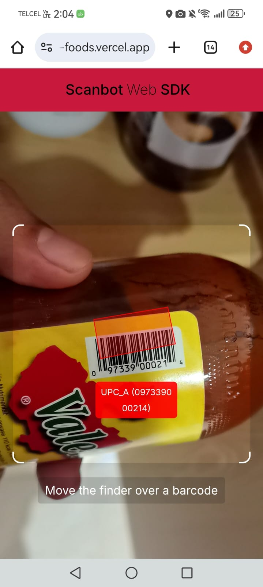
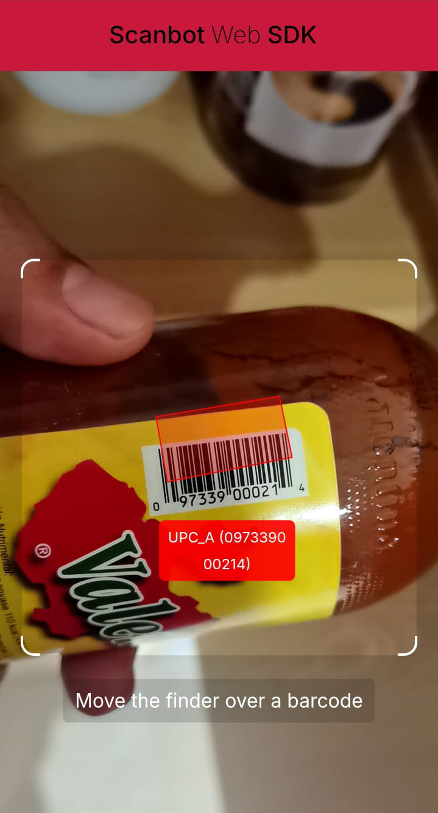
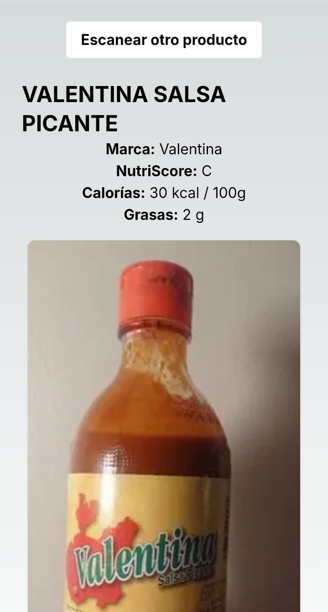

# Open Foods — Barcode Nutrition Scanner

A small personal project I built to scan food product barcodes with my phone's camera and get the nutritional info back instantly. Uses the [Open Food Facts](https://world.openfoodfacts.org/) database, which is the largest open product database in the world (kind of like Wikipedia for food).

**Live demo:** [nextjs-open-foods.vercel.app/open-foods](https://nextjs-open-foods.vercel.app/open-foods)



---

## What it does

You open the site on your phone, point the camera at a barcode, and as soon as the scanner locks onto it, the app fetches the product from Open Food Facts and shows:

- Product name and brand
- **NutriScore** (the European A–E nutrition rating that comes from Open Food Facts)
- Calories per 100g
- Fat content
- Product image

There's also a "Escanear otro producto" button so you can keep scanning without reloading.

| Scanning a barcode | Product info |
|---|---|
|  |  |

## Tech stack

- **Next.js 13** + **React 18**
- **Scanbot Web SDK** (free trial tier) for the barcode scanner
- **Open Food Facts Node.js SDK** for fetching product data
- **Prisma** is installed but not used yet — I left it ready for when I add persistence (favorites, scan history, etc.) in a future version.
- Deployed on **Vercel**

No backend right now — the app talks directly to the Open Food Facts API from the client.

## Why I built it

I wanted to play around with camera access in the browser and see how reliable barcode scanning works on real devices. Open Food Facts has been on my radar for a while since I'm into the whole "what's actually in the food we buy" topic, so it was a good excuse to build something I'd actually use.

Most of the products I scanned at home worked (Valentina, Maruchan, Coca-Cola, etc.), but some Mexican products aren't in the database yet — Open Food Facts is community-maintained so coverage depends on what people have added.

## What I focused on

- **Camera access on mobile.** Browser camera permissions are finicky depending on the device and browser. I had to make sure it works smoothly on both Android Chrome and iOS Safari.

- **Barcode scanning UX.** Instead of taking a picture and processing it, the scanner reads barcodes in real time as you move the phone over the product. Scanbot's SDK handles the heavy lifting here, but tuning the overlay (the bracket finder, the success state, the toast with the detected code) took a bit of work.

- **Working with an open data API.** Open Food Facts is huge but inconsistent — some products have detailed nutrition info, others just have a name. I had to handle missing fields gracefully and decide what to show when data is incomplete.

- **Keeping it minimal (for now).** No backend, no auth. The Open Food Facts API is public and CORS-friendly, so the whole thing runs on the client. The next iteration will add a small backend with Prisma so users can save scan history and favorites — but for the current scope, more architecture would've been overkill.

## Running it locally

```bash
git clone https://github.com/polilla2802/nextjs-open-foods
cd nextjs-open-foods
npm install
npm run dev
```

Then open `http://localhost:3000/open-foods` on your phone (same network as your computer) — you need a mobile device with a camera to actually test the scanner.

The Scanbot SDK runs on its free trial mode out of the box, which adds a small overlay watermark. If you want to remove it, you can get your own license key from [scanbot.io](https://scanbot.io) and add it to the scanner config.

## Notes

This is a personal project, not a commercial product. The data comes from Open Food Facts (community-driven, so it's not always 100% accurate), and the NutriScore is the standard European rating that the API already provides. Mostly I built it to learn and to have a quick way to scan stuff at the supermarket.
